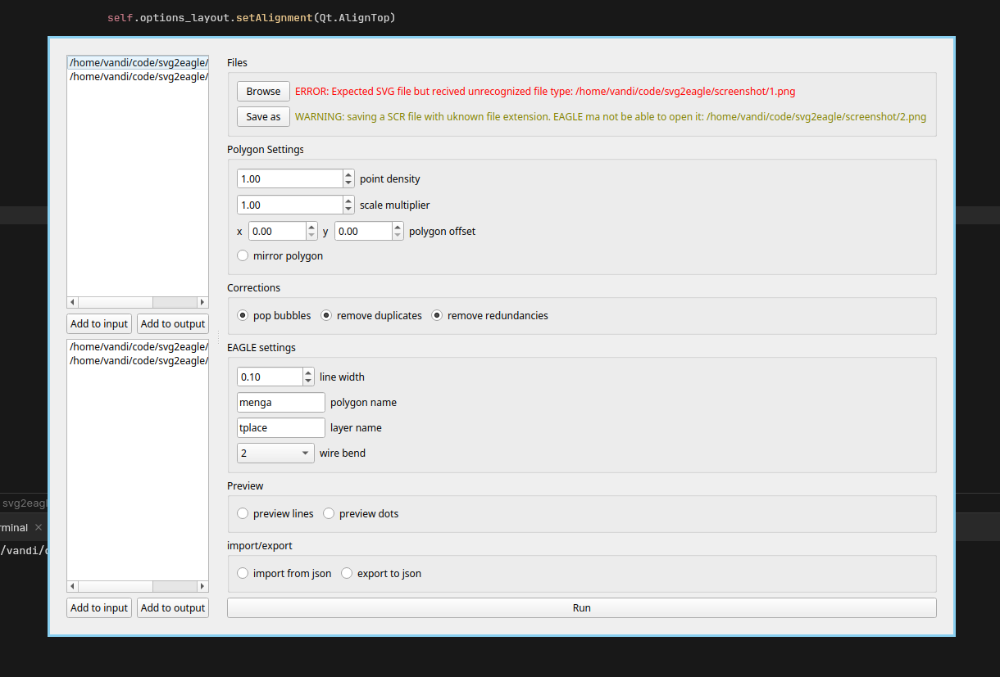
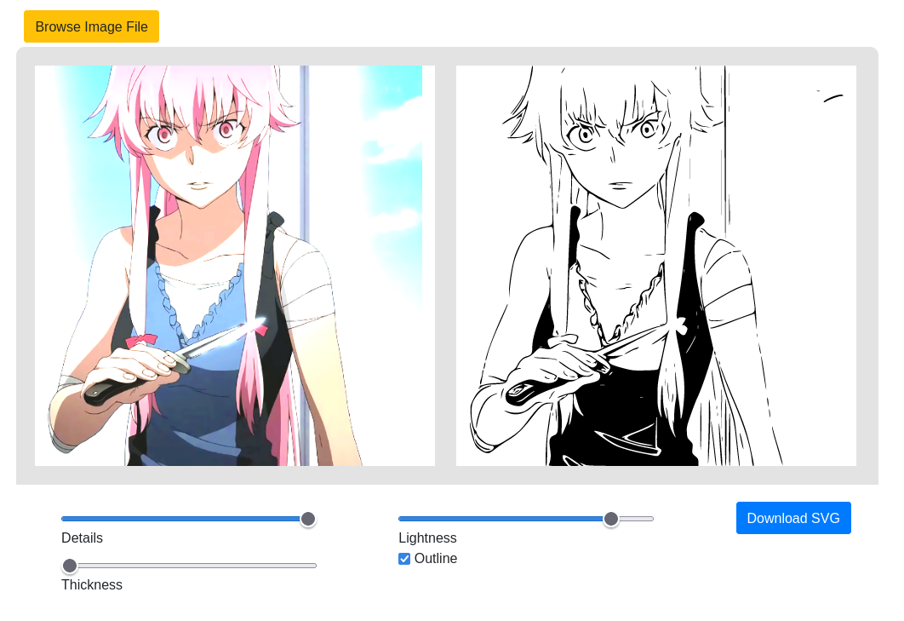
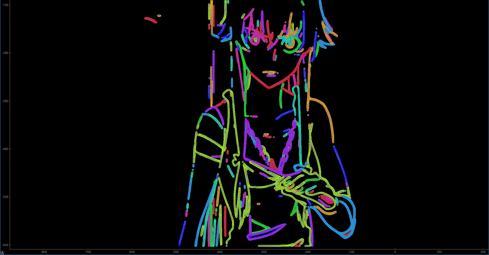
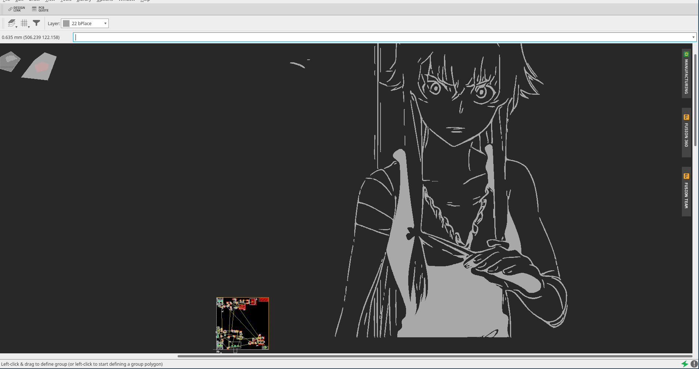

# svg2eagle

Hello 

This repository is decdicated to a little utility application whoose only purpose is to convert scalavle vector graphics aka. thoose pesky image files that end in ".svg" and have infinite resolution to a script that can be pasted in EAGLE and generates a polygon in the shape of the svg on the circuit board. basically it pastes your input svg into the back of your board. I'll have to let you know immediatly that it does not handle colors, but there is a detailed guide below on how to safely create a 95% compatible svg from any png or jpg.

## GUI usage

make sure to install the extra GUI dependencies

```shell
pip install svg2eagle -U
pip install pyqt5
```

call the following command to open the GUI

```shell
svg2eagle-gui
```

**Please make sure to check the guide below on how to create compatible svg images**



## basic command line usage 
yes im lazy enough to just paste the help command output
```
svg2eagle [-h] [-d DENSITY] [-s SCALE] [-o OFFSET OFFSET] [-m] [-i] [-e] [-x] [-X] [-w WIDTH] [-n NAME] [-l LAYER] [-p]
               source destination

positional arguments:
  source                path to source svg or to import json
  destination           destination path for export or script

options:
  -h, --help            show this help message and exit
  -d DENSITY, --density DENSITY
                        how many points per mm should be generated on each line
  -s SCALE, --scale SCALE
                        scale multiplier
  -o OFFSET OFFSET, --offset OFFSET OFFSET
                        offset the points by:
  -m, --dont-mirror     don't mirror the polygon.(use it if you want to print of the front of a circuit. default is back but you
                        can change it by changing the layer)
  -i, --import-polygons
                        import polygons instead of generating it from an svg
  -e, --export-polygons
                        export polygons instead of generating the scipt
  -x, --dont-remove-duplicates
                        don't remove duplicate points from the polygon
  -X, --dont-remove-redundancies
                        dont't remove redunatnd points from the polygon(for now points that are on a straight line and dont change
                        the line angle get removed as they are useless)
  -w WIDTH, --width WIDTH
                        line width in EAGLE™
  -n NAME, --name NAME  name of the generated polygons
  -l LAYER, --layer LAYER
                        layer the polygons will be printed on ('tplace' is the top slkscreen, while 'bplace' is the bottom
                        silkscreen. Note that if you are printingsomrthing on the back of a circuit you need to mirror it)
  -p, --preview         preview the polygons before generating the script.(needs pyqtgraph, pyqt and its dependecies installed. See
                        the github page for help
```

### help i dont know what that means
k here is an example:
```
svg2eagle -p --name gianni -- offset 200 39 "C:\Users\Amogus\Desktop\source.svg" "C:\Users\Amogus\Desktop\destination.scr"
```
now lets go through the command step by step. The first word is `svg2eagle`. This lets the computer know that we are trying to execute that particular program. the rest are just options that explain what it has to do. note that everything that starts with "-" is optional and may be left out if you want to. 

The second command is `-p`. `-p` is short for `--preview` and does the same exact thing. From the table above we can see it does not require additional arguments

Next comes the `--name` option. But from the table above we can see that `--name` alone does not do much. It requires an addition argument. That would be the actual name we want to rename the polygon to. In this case its `gianni`. 

`--offset` works the same exceptit requires two numbers. so we just write `200 39`. Wich means that our polygons are going to be offset by 200 millimeters in the x axis and 39 in the y axis. 

Finally the most important part are the two file paths at the end of the command. They are not preceded by a `--[something]`, they're... just there ig. The program doesen't even work without them. Well of course it doesen't. The first option is the file path of the source SVG we want to import and the second path represents the destination file that will be created once the program has finished running. Is case of any more doubt just google it or open an issue on github.

### advanced usage and tips
You may have noticed that you can export and import polygons. I highly reccomend to just convert the svg to a polygon and export it to a json file. once thats done you can import it again and reexport it to thge same file wqhile previewing all of the steps. Thats because the conversion from svg to polygon takes a considerable amount of time and may lead to miscalculations if everyth9ing is done in a single step. instead let's say you messed up the scale of the polygon, instead of having to regenerating the polygon anew, you can just import the old polygon and generate a script from that. Note that every argument affects the polygon itself and may be used at any time the program is run, except for the density wich is applied when the svg is converted.

## Installation 
first install python at https://www.python.org/downloads/, then just open a terminal and paste in `pip install svg2eagle -U`

### Install optional despondencies

To be able to use the preview flag just open another terminal and paste 
```
pip install pyqtgraph
pip install pyqt5
```

## How to safely create a 95% compatible svg from any png or jpg

Ok here comes the really complicated part. Im guessing you have already choose your favorite dic-pic or amogus-hentai or whatever to print on your board. But wait. The Intro above said only svg is supported. Oh no. What am i going to do now. Don't worry. It's a really easy process that even YOU are able to go through lets start immediatly:

1. For demonstration purpuses, im going to use a picture of Yuno. Now open your favorite web browser (hopefully firefox) and go to https://www.pngtosvg.com/art-vectoriser/. There you can play with the settings a bit untill you are satisfied with the result show in the preview on the right (no you can turn on colors, they cannot be printed on a circuit anyways) (also watch out with the Details setting as having to many shapes puts the pc under significant strain and may take up to 10 minutes to copnvert it to a polygon)
   
2. Then click on "Download SVG" and oh my god, its an svg! Thank you god of file formats. Next there used to be a real big sections on how to handle bubbles inside the svg. But were in the 21th century and my program is ablee to do that himself just fine!!
3. Let's open up a terminal and type `svg2eagle -h` to see how the application works. if you are not familiar with the command propt see the quick guide above or just google online. I suggest exporting the svg to a json first and import it again with a second command in wich we generate the actual script. Just because converting the svg to polygons takes so much time (the rest is really fast don't worry). You can also install pyqt and pyqtgraph and enable the preview to see how the polygon was generated.  

## Import the srcipt in EAGLE
 As you may have noticed, a "xxxx.scr" has been generated. Open your board in EAGLE and go to *Files* > *Execute Script* (NOT *Execute ULP*) and click on it. This will open a popup with various prewritten scripts and options. Ignore everything exept for the *Browse*  button. Click on it and navigate in the newly opened file manager to the "xxxx.scr" you just wrote. Open it and and the programm will start pasting in the polygons. 
### More Resources
In case you did not fully understand the guide above (its very possible, i suck at documentation) here are some additional resources that might help you
- https://learn.sparkfun.com/tutorials/importing-custom-images-into-eagle/method-1-svg-to-polygon
- thats about it, i didn't find anything else

## 1.1.0 Changelog

- wow we have a graphical user interface now

## 1.0.0 Changelog

- Now pop Bubbles automatically!1!1!1!1!1
- offset, mirroring and scaling is now done in post-processing
- added Line-preview option
- minor cleanups 

## License
[MIT](https://mit-license.org/)
