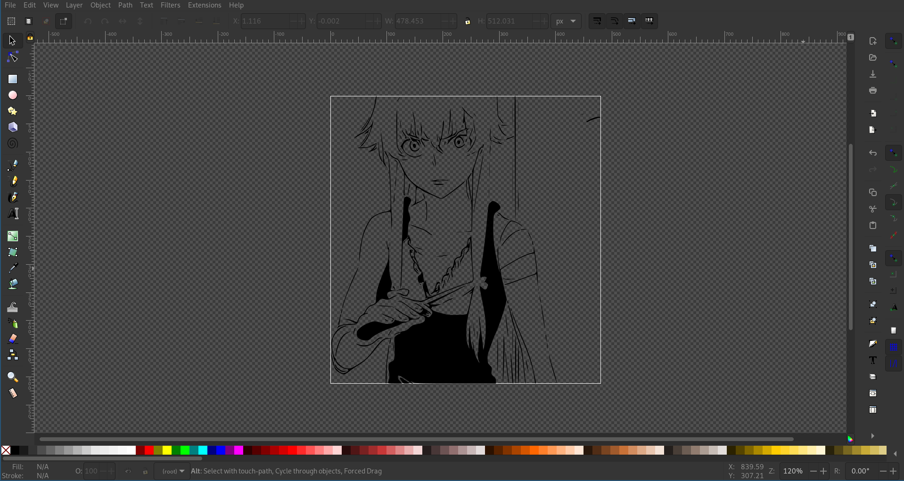

# svg2eagle

Hello 

This repository is decdicated to a little utility application whoose only purpose is to convert scalavle vector graphics aka. thoose pesky image files that end in ".svg" and have infinite resolution to a script that can be pasted in EAGLE and generates a polygon in the shape of the svg on the circuit board. basically it pastes your input svg into the back of your board. I'll have to let you know immediatly that it does not handle holes or colors, but there is a detailed guide below on how to safely create a 95% compatible svg from any png or jpg.

## basic usage 
yes im lazy enough to just paste the help command output
```
svg2eagle [-h] [-d DENSITY] [-s SCALE] [-o OFFSET OFFSET] [-m] [-i] [-e] [-x] [-X] [-w WIDTH] [-n NAME] [-l LAYER] [-p]
               source destination

positional arguments:
  source                path to source svg or to import json
  destination           destination path for export or script

options:
  -h, --help            show this help message and exit
  -d DENSITY, --density DENSITY
                        how many points per mm should be generated on each line
  -s SCALE, --scale SCALE
                        scale multiplier
  -o OFFSET OFFSET, --offset OFFSET OFFSET
                        offset the points by:
  -m, --dont-mirror     don't mirror the polygon.(use it if you want to print of the front of a circuit. default is back but you
                        can change it by changing the layer)
  -i, --import-polygons
                        import polygons instead of generating it from an svg
  -e, --export-polygons
                        export polygons instead of generating the scipt
  -x, --dont-remove-duplicates
                        don't remove duplicate points from the polygon
  -X, --dont-remove-redundancies
                        dont't remove redunatnd points from the polygon(for now points that are on a straight line and dont change
                        the line angle get removed as they are useless)
  -w WIDTH, --width WIDTH
                        line width in EAGLE™
  -n NAME, --name NAME  name of the generated polygons
  -l LAYER, --layer LAYER
                        layer the polygons will be printed on ('tplace' is the top slkscreen, while 'bplace' is the bottom
                        silkscreen. Note that if you are printingsomrthing on the back of a circuit you need to mirror it)
  -p, --preview         preview the polygons before generating the script.(needs pyqtgraph, pyqt and its dependecies installed. See
                        the github page for help
```

### help i dont know what that means
k here is an example:
```
svg2eagle -p --name gianni -- offset 200 39 "C:\Users\Amogus\Desktop\source.svg" "C:\Users\Amogus\Desktop\destination.scr"
```
now lets go through the command step by step. The first word is `svg2eagle`. This lets the computer know that we are trying to execute that particular program. the rest are just options that explain what it has to do. note that everything that starts with "-" is optional and may be left out if you want to. 

The second command is `-p`. `-p` is short for `--preview` and does the same exact thing. From the table above we can see it does not require additional arguments

Next comes the `--name` option. But from the table above we can see that `--name` alone does not do much. It requires an addition argument. That would be the actual name we want to rename the polygon to. In this case its `gianni`. 

`--offset` works the same exceptit requires two numbers. so we just write `200 39`. Wich means that our polygons are going to be offset by 200 millimeters in the x axis and 39 in the y axis. 

Finally the most important part are the two file paths at the end of the command. They are not preceded by a `--[something]`, they're... just there ig. The program doesen't even work without them. Well of course it doesen't. The first option is the file path of the source SVG we want to import and the second path represents the destination file that will be created once the program has finished running. Is case of any more doubt just google it or open an issue on github.

## Installation 
first install python at https://www.python.org/downloads/, then just open a terminal and paste in `pip install svg2eagle`

### Install optional depndencies
To be able to use the preview flag just open another terminal and paste 
```
pip install pyqtgraph
pip install pyqt5
```

## How to safely create a 95% compatible svg from any png or jpg

Ok here comes the really complicated part. Im guessing you have already choose your favorite dic-pic or amogus-hentai or whatever to print on your board. But wait. The Intro above said only svg is supported. Oh no. What am i going to do now. Don't worry. It's a really easy process that even YOU are able to go through lets start immediatly:

1. For demonstration purpuses, im going to use a picture of Yuno. Now open your favorite web browser (hopefully firefox) and go to https://www.pngtosvg.com/art-vectoriser/. There you can play with the settings a bit untill you are satisfied with the result show in the preview on the right (no you can turn on colors, they cannot be printed on a circuit anyways) (also watch out with the Details setting as having to many shapes puts the pc under significant strain and may take up to 10 minutes to copnvert it to a polygon)
   
2. Now click on "Download SVG" and oh my god, its an svg! Thank you god of file formats. Well don't thank him yet there is still work to do. Now go to https://inkscape.org/release and download the latest release of Inkscape, the actual svg god. Inkscape is nothing else than the GIMP of SVGs. It has all the tools we will be needing in the next few minutes and so much more. 

3. To begin, we import our newly imported svg in Inkscape. Then select the object that is filling the canvas and click on the menubar on *Path* > *Object To Path* or Press `Shift+Ctrl+C`. Now go to *Path* > *Break Apart* or press `Shift+Ctrl+K`. Oh what happened?!? why are parts of my beautful vectorized amogus disapperingor getting filled up? Don't worry, thats exactly what we are trying to prevent here. Basically by braking apart the initial vector graphing into multiple vector graphics, thoose vectors that where excluding the filling of the bigger vector they where in now aren't connected anymore. the result is that any space bubble that was once inside the big vector is now being treated as a separate filled vector altogether. One might think now, "well then just leave it as it was before, nothing  wrong with that". The issue is that Eagle only works with individual polygons. it is after 30 years still unable to cut out a polygon from another one. So we have to manually go and break and somehow connect the bubbles with the free space outside. 
4. First thing to do is choose a bubble. I took the one in the left part of the collar as it is easly accessible and a good example. Then draw any shape or path that connects the bubble and the space outside the bubble up. ive used a red rectangle for comodity but any shape works. 
5. Now hold shift and click first on the rectangle and then on the collar while still holding down shift. this will select both shapes at the same times. now click on *Path* > *Division* or press `Ctrl+/`. The red rectangle is cast into the endless abysss of nothingnesss forever, but looking at the bubble it is now connected to the outside and not a bubble anymore. we actually cut out a red rectangle shaped piece of collar out of the collar that is now a completly separate shape, wich means no bubble. Trust me. Also Repeat the last two steps with al the bubbles you can find. 
6. At good last go abck to *Path* > *Break Apart* or press `Shift+Ctrl+K` and watch as nothing happenes as all bubbles have been brutally cut open. (I suggest selecting everything with `Ctrl+A` and braking apart multiple times as sometimes there are nested vector structures we dont really want) Well almost. as i explained before, this command breaks the massive vector into smaller individual vectors that my script can handle.
7. Now our intervention with Inkscape has concluded. open up a terminal and type `svg2eagle -h` to see how the application works. I suggest exporting the svg to a json first and import it again with a second command in wich we generate the actual script. Just because converting the svg to polygons takes so much time (the rest is really fast don't worry). You can also install pyqt and pyqtgraph and enable the preview to see how the polygon was generated.  
8. For our next and final step, open your board in EAGLE and go to *Files* > *Execute Script* (NOT *Execute ULP*) and click on it. This will open a popup with various prewritten scripts and options. Ignore everything exept for the *Browse*  button. Click on it and navigate in the newly opened file manager to the script you just wrote. Open it and and the programm will start pasting in the polygons. 
### More Resources
In case you did not fully understand the guide above (its very possible, i suck at documentation) here are some additional resources that might help you
- https://learn.sparkfun.com/tutorials/importing-custom-images-into-eagle/method-1-svg-to-polygon
- thats about it, i didn't find anything else
## License
[MIT](https://mit-license.org/)